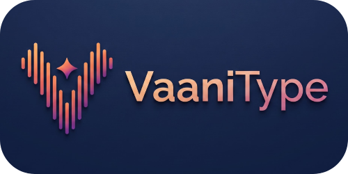

# Leave fingers behind and speak your mind - Free with VaaniType.

<h3 align="center">🎙️ VaaniType — Next-Gen Live AI Voice Dictation for Windows</h3>

  <em>Powered by Google Gemini 3.5 Transcribe Live Engine</em>

  
  
  

---

## ✨ Features
- ⚡ **Zero-Latency Streaming:** Real-time word-by-word typing directly at the cursor.
- 🔮 **Gemini Live Aurora Glow:** Sleek floating pill widget with voice-reactive animated light trails.
- ⏸️ **Instant Pause / Resume:** Standby controls with active state memory.
- ⚡ **Smart Voice Commands:** 
  - `Vaani delete that` ➔ Deletes the last spoken word
  - `Vaani delete all` ➔ Clears all text
  - `Vaani undo` ➔ Undoes last typed chunk
  - `Vaani new line` ➔ Presses Enter
  - `Vaani add space` ➔ Inserts a space
- 🔒 **100% Private (BYOK):** Direct client-to-Google encrypted stream. Zero intermediate servers.
- 🚀 **Windows Auto-Start:** Configurable launch on Windows bootup.

---

## 📥 Download & Install (Windows 10 / 11)
1. Go to the [Releases](https://github.com/pawan-maurya/VaaniType/releases) section.
2. Download `VaaniType_Setup_v0.0.1.exe`.
3. Run the installer and launch VaaniType!

---

## ⌨️ Default Shortcut
- **Alt + V** (Customizable in Settings)
- **Right-Click** on the widget to open Settings & Guide.

---

## 📜 License
Licensed under the [MIT License](LICENSE).
